<!-- EDIT: links -->
[linkedin](https://linkedin.com/in/sxlmwn)

<!-- EDIT: bio -->
> BS Software Engineering student at COMSATS University Islamabad (batch 2025–2029). 
> AI/ML intern at Cybergen–Qubit Dynamics, working on QA/SQA and R&D.

<!-- EDIT: stack -->
<samp>python &nbsp; c++ &nbsp; java &nbsp; javascript &nbsp; typescript &nbsp; react &nbsp; node &nbsp; sql &nbsp; bash &nbsp; docker &nbsp; git</samp>

<!-- EDIT: project -->
More soon — actively shipping.

